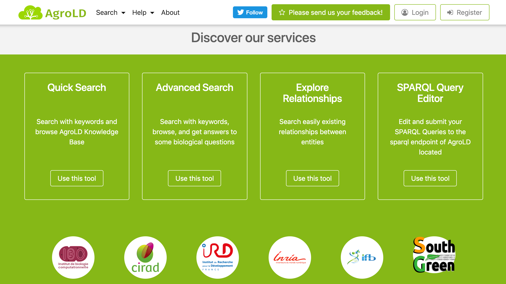

# AgroLD

AgroLD is a RDF knowledge base that consists of data integrated from a variety of plant resources and ontologies. The aim of the Agronomic Linked Data (AgroLD) project is to provide a portal for bioinformatics and domain experts to exploit the homogenized data models towards efficiently generating research hypotheses.


# Contact

For bug tracking purpose you can use the GitHub or questions about AgroLG, you can contact the mainteners using the following email addresses:

* nordine.elhassouni_at_cirad.fr
* pierre.larmande_at_ird.fr


# Valorization

* [https://tel.archives-ouvertes.fr/IBC/hal-01176903v1](https://tel.archives-ouvertes.fr/IBC/hal-01176903v1) 
* [http://ceur-ws.org/Vol-1546/poster_55.pdf](http://ceur-ws.org/Vol-1546/poster_55.pdf)


# Contributing

* Intellectual property belongs to IRD, CIRAD, IBC, INRA, IFB, ELIXIR, and SouthGreen development platform.
* Written by Aravind Venkatesan, Pierre Larmande, Gildas Tagny, Imene chentli, Nordine El Hassouni, Manuel Ruiz and Patrick Valduriez.
* Copyright 2014-2016


# The Architecture of project


AgroLD project is composed of two component: [AgroLD_ETL](/AgroLD_ETL)  and  [agrold_webapp](/agrold_webapp)


* The first component is a set of Parser and wrapper for translate a dataset. Follow this link for to know what data have been translated in RDF: [Documentation](http://agrold.southgreen.fr/documentation.jsp)  

* The second component is the web application who is connected at the triple store for to make queries.
 
***

```
 AgroLD_ETL
	-> model
	-> rdf_ttl
	-> riceKB
	-> test_files
	-> riceKBpipeline.py
 agrold_webapp
```
***


### AgroLD_ETL


Contains parsers and model used to convert data considered for AgroLD to RDF.

* [model](/AgroLD_ETL/model): All documents who describe how data are transformed
* [rdf_ttl](/AgroLD_ETL/rdf_ttl): All output of transformation sort by dataset
* [riceKB](/AgroLD_ETL/riceKB): Contains scripts used for each data set
* [test_files](/AgroLD_ETL/test_files): All test files in input ( heterogeneous format: csv, tabbed files, gff3 )
* [riceKBpipeline.py](/AgroLD_ETL/riceKBpipeline.py): Script file where we have centralised all execution


The type of each dataset is different, GFF, HapMap, CSV and VCF. In first time we have developed parser for build a dictonary, 
because is easy to browse a dictionary and create the RDF 


### agrold_webapp

Scripts used for website UI, contains scripts for AgroLD API feature and all SPARQL query.
The front office (is any tools that has a direct relation to customers) of AgroLD web application are written in JavaScript and the back office (interne fonctionnalities) is written in JAVA.




#### [Quick search](http://agrold.southgreen.fr/quicksearch.jsp)

Quick search is based on keyword search and aids in
understanding the underlying knowledge

#### [Explore Relationships]( http://agrold.southgreen.fr/relfinder.jsp)
The Explore Relationships tool aids in exploring relationships between existing entities.

#### [Advanced Search](http://agrold.southgreen.fr/advancedSearch.jsp)
The Advanced Search query form is based on the REST API suite, developed under the AgroLD project. The aim of this effort is to provide non-technical users with a tool to query the knowledge base.


#### [SPARQL Query](http://agrold.southgreen.fr/sparqleditor.jsp)
The SPARQL Query Editor provides an interactive environment to formulate SPARQL queries.


# How to use AgroLD

###agrold_webapp

```
For execute the projet in your local host:
/agrold_webapp/target/agrold.war
load the war in your tomcat and go in localhost:8080/agrold
```

###AgroLD_ETL

For example if you want to execute a gff3 parser for to build a dictionary.
define a input file

```
AgroLD/AgroLD_ETL/riceKB/gffParser.py

path = '/os_file_gff3/file.gff3'     # The input

ds = parseGFF3(path)   # The parsing file

```

> **The dictionary :** The GFF3 Parser is a generic fonction who build a dictionary, it easy to browse this dictionary for build RDF data 


```
{   'attributes': {   'Dbxref': 'InterPro:IPR005333,InterPro:IPR017887',
                          'ID': 'BGIOSGA000770-TA',
                          'Name': 'BGIOSGA000770-TA',
                          'Parent': 'BGIOSGA000770'},
        'end': 35414873,
        'phase': None,
        'score': None,
        'seqid': 'Osi01',
        'source': 'glean',
        'start': 35413950,
        'strand': '-',
        'type': 'mRNA'},
    {   'attributes': {   'Derives_from': 'BGIOSGA000770-TA',
                          'ID': 'BGIOSGA000770-TA_protein',
                          'Name': 'BGIOSGA000770-TA'},
        'end': 35414873,
        'phase': None,
        'score': None,
        'seqid': 'Osi01',
        'source': 'glean',
        'start': 35413950,
        'strand': '-',
        'type': 'polypeptide'},
    {   'attributes': {   'Parent': 'BGIOSGA000770-TA'},
        'end': 35414873,
        'phase': '0',
        'score': None,
        'seqid': 'Osi01',
        'source': 'glean',
        'start': 35413950,
        'strand': '-',
        'type': 'CDS'},
    {   'attributes': {   'Parent': 'BGIOSGA000770-TA'},
        'end': 35414873,
        'phase': None,
        'score': None,
        'seqid': 'Osi01',
        'source': 'glean',
        'start': 35413950,
        'strand': '-',
        'type': 'exon'},

```

### Documentation

- AgroLD includes data on the following species on :  [Species](http://agrold.southgreen.fr/documentation.jsp#species)
- Ontologies in AgroLD : [Ontologies](http://agrold.southgreen.fr/documentation.jsp#ontologies)
- Data sources in AgroLD : [Data](http://agrold.southgreen.fr/documentation.jsp#sources)
- Species specific break down of the data sources : [Link](http://agrold.southgreen.fr/documentation.jsp#break-down)
- Graph Names : [Link](http://agrold.southgreen.fr/documentation.jsp#graphs)
- URIs :  [Link](http://agrold.southgreen.fr/documentation.jsp#uri)


